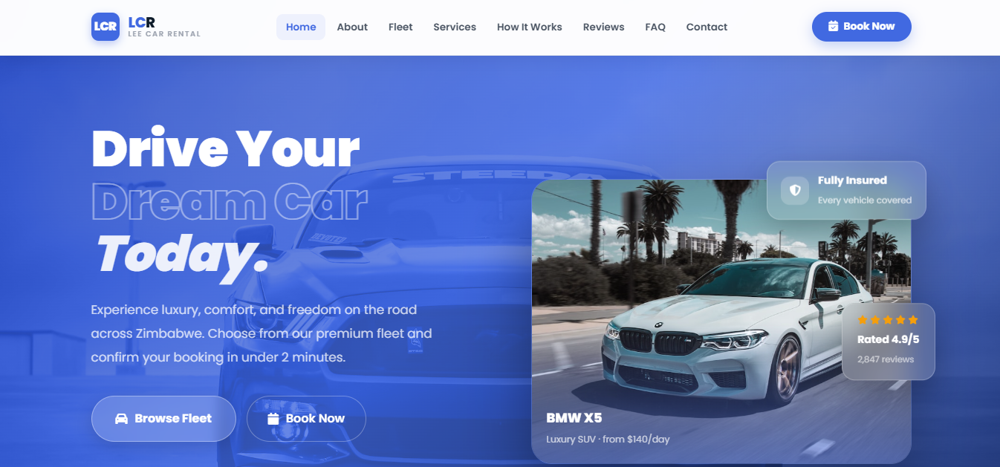

<div align="center">

<br/>


<br/>

# LCR — Lee Car Rental

<p><em>Premium car rental experience · Mutare, Zimbabwe</em></p>


<br/>

[](https://lee-car-rental-cqtj60zyl-lee-simoyis-projects.vercel.app)
&nbsp;
[](https://github.com/yourusername/Lee-Car-Rental)

<br/>



</div>

<br/>

---

## 👋 About This Project

**LCR — Lee Car Rental** is a fully responsive, single-page car rental website I built from scratch using only HTML, CSS, and vanilla JavaScript — no frameworks, no build tools.

The goal was to design and develop a polished, production-quality product that delivers a premium feel: smooth animations, rich interactivity, a complete booking flow, and a design system that scales cleanly across every device size.

> Everything you see — the UI, the data layer, the animation system, the responsive layout — is hand-written.

---

## ✨ Highlights

<table>
<tr>
<td width="50%">

### 🎨 Design System
- CSS custom properties for full-site theming
- Poppins typeface · 9 font weights
- Glassmorphism booking form
- Consistent spacing, radius & shadow tokens

</td>
<td width="50%">

### ⚡ Interactions
- Scroll-reveal with `IntersectionObserver`
- Animated number counters with easing
- Smooth section transitions throughout
- Toast notifications on form submit

</td>
</tr>
<tr>
<td width="50%">

### 🚗 Car Detail Page
- Full-screen slide-over (`translateX` transition)
- 6-image gallery per vehicle with label overlays
- Thumbnail strip + arrow navigation + keyboard support
- Tabbed content: Overview · Gallery · Pricing

</td>
<td width="50%">

### 📱 Responsive Layout
- 5 breakpoints from 390px to 1440px+
- Mobile drawer with backdrop blur
- Adaptive grids across all sections
- Touch-friendly targets throughout

</td>
</tr>
</table>

---

## 🛠️ Built With

| Technology | Purpose |
|:-----------|:--------|
|  | Semantic page structure — 10 sections in one file |
|  | 1,800+ lines — design system, animations, 5 breakpoints |
|  | All interactivity, data rendering, event handling |
|  | 60+ icons across the UI |
|  | Poppins (300–900 weights) |
|  | Hosting & continuous deployment |

---

## 🗂️ What's Inside

```
Lee-Car-Rental/
├── 📄 index.html          # Full page — navbar, 10 sections, modals, footer
├── 🎨 style.css           # Design system + all component styles
├── ⚡ script.js           # CAR_DATA · SVC_DATA · UI logic · animations
└── 🖼️  imgs/              # Local vehicle photography (30+ images)
```

---

## 🚘 Fleet System

Six vehicles, each with a complete data object powering the detail page:

```js
CAR_DATA.camry = {
  name, subtitle, price, badge,
  images:   [ /* 6 labelled gallery shots */ ],
  specs:    [ /* 8 technical rows */ ],
  features: [ /* 8 key highlights */ ],
  pricing:  [ /* daily · weekly · monthly cards */ ],
  photos:   [ /* gallery tab images */ ],
}
```

| Vehicle | Class | From |
|:--------|:------|-----:|
| 🔵 BMW X5 | Luxury SUV | $140/day |
| 🟣 Mercedes-Benz C300 | Luxury Sedan | $120/day |
| ⚡ Tesla Model 3 | Electric Sedan | $95/day |
| 🟠 Ford Explorer | Full-Size SUV | $75/day |
| 🟡 Toyota Camry | Mid-Size Sedan | $45/day |
| 🟢 Honda Civic | Compact Sedan | $35/day |

---

## 📸 Key Pages & Features

### Hero Section
Full-viewport banner with animated headline, live stat counters, glass-morphism floating badges, and an interactive thumbnail strip that swaps the featured car with a crossfade transition.

### Car Detail Page
A full-screen slide-over triggered per vehicle. Includes a 6-shot image gallery (exterior, side, dynamic, dashboard, interior, night), spec table, features checklist, three pricing tiers, and an "Also Available" strip — all driven by the `CAR_DATA` object.

### Services Modal
Six service cards (Daily Rental · Airport Transfer · Corporate · Chauffeur · Safari · Roadside) each open a centred popup with a banner image, feature grid, pricing block, and CTA buttons.

### Booking Form
Dark glassmorphism card with vehicle pre-selection (passed from car cards), date pickers with automatic min-date enforcement, and a toast confirmation on submit.

### Contact Section
Google Maps embed with hover greyscale-to-colour effect, dark business hours panel, topic chip selector, and a full enquiry form — all in a two-column responsive layout.

---

## 📐 Responsive Breakpoints

| Breakpoint | What Changes |
|:-----------|:-------------|
| `≤ 1024px` | Hero & About collapse to single column · Fleet goes 2-col |
| `≤ 900px` | Desktop nav replaced by hamburger + slide-in drawer |
| `≤ 720px` | Fleet · Services · Reviews all go single column |
| `≤ 600px` | Date row stacks · Form grid collapses · Separators hidden |
| `≤ 390px` | Final font and padding reductions |

---

## 🗺️ Roadmap

- [x] Full responsive layout across 5 breakpoints
- [x] Car Detail Page — slide-over with gallery + tabs
- [x] Service Modal popup system
- [x] Mobile drawer navigation
- [x] Booking form with date logic
- [x] FAQ accordion · Reviews · Contact form
- [ ] Firebase Authentication
- [ ] Real-time booking API
- [ ] Admin dashboard

---

<div align="center">

<br/>


**LCR Lee Car Rental** · Mutare, Zimbabwe · © 2026

*Built entirely by hand — HTML, CSS & JavaScript*

<br/>


</div>
