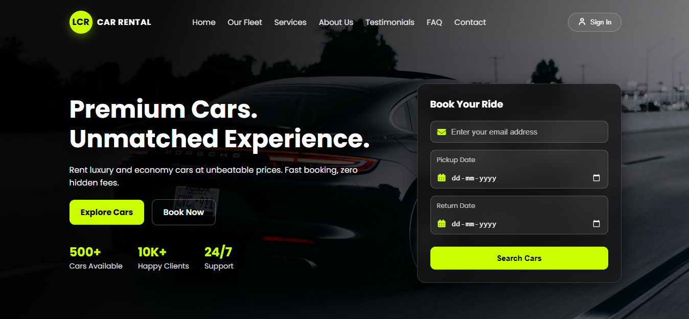

#  Lee Car Rental — Premium Single Page Car Rental Website



> **Drive Excellence. Experience Comfort.**  
A modern, fully responsive premium single-page car rental website built with **HTML, CSS, JavaScript, and Firebase Authentication**.

Lee Car Rental delivers a luxury digital experience for customers looking to rent premium, SUV, and economy vehicles through an elegant and interactive booking interface.

---

##  Live Preview

<a href="https://lee-car-rental-cqtj60zyl-lee-simoyis-projects.vercel.app" target="_blank">

</a>

<a href="https://github.com/yourusername/Lee-Car-Rental" target="_blank">

</a>

---

##  Overview

Lee Car Rental is a polished frontend web project designed to simulate a real-world car rental platform.

It combines sleek UI/UX design, responsive layouts, vehicle filtering, interactive booking modals, Google authentication, and premium branding into one powerful single-page experience.

### Perfect for:

- Portfolio showcase  
- Frontend developer projects  
- Car rental startup templates  
- Booking system UI inspiration  
- Premium landing page design  

---

##  Features

### Premium User Interface
- Modern hero section with call-to-actions  
- Luxury brand styling  
- Smooth spacing, clean layout, polished typography  

### Fully Responsive Design
Optimized for:

- Mobile phones  
- Tablets  
- Fold devices  
- Desktop screens  
- Large monitors  

### Fleet System
- Dynamic vehicle cards rendered with JavaScript  
- Premium / SUV / Economy filters  
- Live search functionality  
- Pricing display  

### Car Details Modal
Each car includes:

- Multiple images gallery  
- Transmission  
- Seats  
- Fuel type  
- Features  
- Dynamic total price calculator  

### Booking Modal
Interactive rental form with:

- Customer details  
- Pickup / return dates  
- Auto day calculation  
- Total rental price  
- Payment options  

### Authentication System
Powered by **Firebase**

- Sign In popup  
- Create Account UI  
- Continue with Google  
- Persistent login session  

### Additional Sections
- Testimonials slider  
- FAQ accordion  
- About section  
- Services modal  
- Contact form  
- Google Maps embed  
- Premium footer CTA  

### Scroll Animations
- Reveal on scroll  
- Smooth section transitions  
- Professional interactions  

---

##  Tech Stack

| Technology | Usage |
|-----------|------|
| HTML5 | Structure |
| CSS3 | Styling & Responsive Design |
| JavaScript (Vanilla) | Interactivity |
| Firebase Auth | Google Authentication |
| Font Awesome | Icons |
| Google Fonts | Typography |

---

##  Project Structure

```bash
Lee-Car-Rental/
│── index.html
│── style.css
│── script.js
│── imgs/
│   ├── LCR-Banner.png
│   ├── Range Rover.png
│   ├── BMW.jpeg
│   ├── Toyota Fortuner.png
│   └── more-assets
